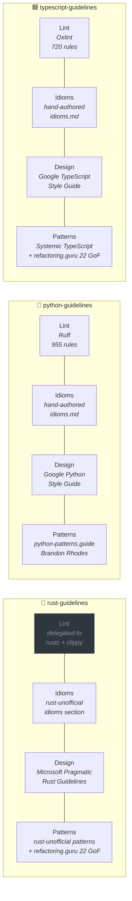

# lang-guidelines

Three language-specific Agent Skills that enforce lint rules, design
guidelines, and idiomatic patterns while an AI agent writes or edits code —
not only during review.

- **`rust-guidelines/`** — Microsoft's Pragmatic Rust Guidelines (design) +
  rust-unofficial patterns (idioms, design patterns, anti-patterns) + 22
  Gang-of-Four patterns adapted to Rust (refactoring.guru). Mechanical /
  style / correctness checks are left to `rustc` + `clippy`.
- **`python-guidelines/`** — 955 Ruff lint rules (tiered) + Google Python Style
  Guide (design) + python-patterns.guide (Pythonic design patterns).
- **`typescript-guidelines/`** — 720 Oxlint lint rules (tiered) + Google
  TypeScript Style Guide (design) + Systemic TypeScript (Vincent Alandev)
  + 22 Gang-of-Four patterns adapted to TypeScript (refactoring.guru).

Each skill is a self-contained folder following the open
[Agent Skills standard](https://agentskills.io). Works unchanged with
Claude Code, Codex, Gemini CLI, Cursor, VS Code, GitHub Copilot, OpenCode,
OpenHands, Goose, and [30+ other agents](https://agentskills.io/home).

## What a skill gives the agent

Each skill packages four conceptual layers of knowledge, from the most
mechanical to the most architectural. An agent that loads the skill writes
code informed by **all four layers at once**.

```mermaid
flowchart TB
    L4[<b>PATTERNS</b><br/>reusable solutions to recurring design problems<br/><i>builder, strategy, newtype, RAII guards, typestate, GoF…</i>]
    L3[<b>DESIGN</b><br/>architectural decisions the compiler cannot make<br/><i>module boundaries, API shape, error philosophy, docs, crates</i>]
    L2[<b>IDIOMS</b><br/>local positive patterns — "prefer X over Y"<br/><i>Path over os.path · const over let · Default over custom ctor</i>]
    L1[<b>LINT</b><br/>mechanical correctness + security<br/><i>the things a linter or compiler can mechanically check</i>]

    L1 --> L2 --> L3 --> L4

    style L1 fill:#bf8700,stroke:#9a6700,color:#fff
    style L2 fill:#0969da,stroke:#054d9e,color:#fff
    style L3 fill:#8250df,stroke:#5a1fb0,color:#fff
    style L4 fill:#1a7f37,stroke:#116329,color:#fff
```

*The layers are cumulative: fixing every lint violation does not produce
good code — it produces mechanically-correct code. Good code requires the
layers above.*

## How each skill fills the layers

Different languages have different canonical sources for each layer. Rust
delegates the bottom layer to `rustc` + `clippy` — this repo covers
everything above that.



*Every cell above is a separate file in the skill folder. `guidelines.txt`
and `style.md` feed the lint layer; `idioms.md`, `design.md`, and
`patterns.md` feed the three conceptual layers above it.*

## What the agent sees at trigger time

| Skill | Always-loaded | On-demand | Framework-gated |
|---|---|---|---|
| `rust-guidelines` | `guidelines.txt` (90 KB, Microsoft design guide) · `patterns.md` (277 KB, rust-unofficial + 22 GoF) | — | — |
| `python-guidelines` | `guidelines.txt` (161 KB, 642 lint rules) · `design.md` (116 KB, Google style guide) · `patterns.md` (225 KB, python-patterns.guide) · `idioms.md` | `style.md` (73 KB, 275 pedantic lint rules) · `rules/<slug>/index.md` | `frameworks/{airflow,django,fastapi,numpy,pandas}.md` |
| `typescript-guidelines` | `guidelines.txt` (61 KB, 210 lint rules) · `design.md` (104 KB, Google style guide) · `patterns.md` (190 KB, Systemic TS + 22 GoF patterns) · `idioms.md` | `style.md` (91 KB, 280 pedantic lint rules) · `rules/<plugin>/<slug>/index.md` | `frameworks/{react,nextjs,vue,jest,vitest,jsdoc}.md` |

Each rule is rendered in a compact, imperative form:

```
### no-console (eslint)
Do not use console methods in production code.
❌ console.log("debug", user)
✅ logger.debug({ user }, "debug")
```

## Layout

```
rust-guidelines/
├── SKILL.md
├── guidelines.txt       # Microsoft Pragmatic Rust Guidelines — design layer
└── patterns.md          # rust-unofficial + refactoring.guru 22 GoF patterns

python-guidelines/
├── SKILL.md
├── guidelines.txt       # Tier 1 (correctness+security) + Tier 2 (modernization) lint rules
├── design.md            # Google Python Style Guide — design decisions
├── patterns.md          # python-patterns.guide — Pythonic design patterns
├── idioms.md            # Positive local patterns ("prefer X over Y")
├── style.md             # Tier 3 style/pedantic (load on demand)
├── frameworks/          # Gated by project stack (airflow, django, fastapi, numpy, pandas)
└── rules/<slug>/index.md  # Full per-rule docs with examples + config

typescript-guidelines/
├── SKILL.md
├── guidelines.txt       # Tier 1 + Tier 2 lint rules
├── design.md            # Google TypeScript Style Guide — design decisions
├── patterns.md          # Systemic TS (Alandev) + 22 GoF patterns (refactoring.guru)
├── idioms.md            # Positive local patterns
├── style.md             # Tier 3 style/pedantic (load on demand)
├── frameworks/          # react, nextjs, vue, jest, vitest, jsdoc
└── rules/<plugin>/<slug>/index.md
```

## Install

### Recommended — `skills` CLI ([skills.sh](https://skills.sh/))

The open-ecosystem CLI from Vercel Labs supports 45+ agents (Claude Code,
Codex, Cursor, Gemini, OpenCode, Copilot, Goose, Windsurf, Amp, Kiro,
Factory Droid, Roo, Cline, …). One command per project or global:

```bash
# Install all three skills globally (symlinked, easy updates)
npx skills add youssef-tharwat/lang-guidelines --all -g

# Or install just one
npx skills add youssef-tharwat/lang-guidelines --skill python-guidelines -g

# Or scope to a single project
cd my-project
npx skills add youssef-tharwat/lang-guidelines --all

# Target specific agents
npx skills add youssef-tharwat/lang-guidelines --all -a claude-code -a cursor
```

Browse the live leaderboard at <https://skills.sh/> or search for the repo at
`skills.sh/youssef-tharwat/lang-guidelines` once install telemetry accumulates.

### Manual — `git clone` + symlinks

For agents not yet supported by the CLI, or for custom install locations:

```bash
git clone https://github.com/youssef-tharwat/lang-guidelines ~/src/lang-guidelines

# Claude Code
ln -s ~/src/lang-guidelines/rust-guidelines       ~/.claude/skills/rust-guidelines
ln -s ~/src/lang-guidelines/python-guidelines     ~/.claude/skills/python-guidelines
ln -s ~/src/lang-guidelines/typescript-guidelines ~/.claude/skills/typescript-guidelines

# Gemini CLI (~/.gemini/skills/), Codex, OpenCode, … — same pattern, different target dir.
# See per-agent docs at https://agentskills.io/home.
```

### Direct copy (any agent)

```bash
cp -R rust-guidelines       <agent-skills-dir>/
cp -R python-guidelines     <agent-skills-dir>/
cp -R typescript-guidelines <agent-skills-dir>/
```

## How the agent uses a skill

1. At startup the agent reads every skill's `name` and `description` from
   `SKILL.md` frontmatter (~100 words each, always in context).
2. When a user task matches a skill's description, the agent loads the full
   `SKILL.md` body.
3. `SKILL.md` instructs the agent to read — **before writing code** — the
   Tier-1 files for that skill:
   - `guidelines.txt` (lint rules, except for `rust-guidelines` where it
     holds design rules since the compiler covers lint).
   - `design.md` (architectural guidelines; Python + TypeScript only).
   - `patterns.md` (reusable design patterns; all three skills).
   - `idioms.md` (positive local patterns; Python + TypeScript only —
     rust-unofficial's idioms section is inlined in `patterns.md`).
4. For style reviews or framework-specific work, the agent loads `style.md`
   or `frameworks/<name>.md` on demand.
5. For rule edge cases, the agent greps `rules/<slug>/index.md` for the
   full upstream doc.

Progressive disclosure keeps the context footprint minimal while making
~1,700 lint rules + ~50 Microsoft design rules + ~150 concatenated pattern
sections fully reachable.

## Sources

**Rust**
- Design guidelines: [microsoft/rust-guidelines](https://github.com/microsoft/rust-guidelines) — Microsoft's Pragmatic Rust Guidelines
- Community patterns: [rust-unofficial.github.io/patterns](https://rust-unofficial.github.io/patterns/) — Rust idioms, design patterns, anti-patterns, functional patterns
- Classical patterns: [refactoring.guru/design-patterns/rust](https://refactoring.guru/design-patterns/rust) — 22 Gang-of-Four patterns with Rust examples
- **Mechanical checks**: delegated to [`rustc`](https://doc.rust-lang.org/rustc/) + [`clippy`](https://doc.rust-lang.org/clippy/) — this skill is design-only by design.

**Python**
- Lint rules: [docs.astral.sh/ruff/rules/](https://docs.astral.sh/ruff/rules/) — Ruff
- Design guidelines: [google.github.io/styleguide/pyguide.html](https://google.github.io/styleguide/pyguide.html) — Google Python Style Guide
- Design patterns: [python-patterns.guide](https://python-patterns.guide/) — Brandon Rhodes

**TypeScript / JavaScript**
- Lint rules: [oxc.rs/docs/guide/usage/linter/rules](https://oxc.rs/docs/guide/usage/linter/rules) — Oxlint
- Design guidelines: [google.github.io/styleguide/tsguide.html](https://google.github.io/styleguide/tsguide.html) — Google TypeScript Style Guide
- Systemic architecture: [valand.dev/systemic-ts](https://valand.dev/systemic-ts) — Systemic TypeScript by Vincent Alandev
- Design patterns: [refactoring.guru/design-patterns/typescript](https://refactoring.guru/design-patterns/typescript) — 22 GoF patterns with TS examples
- Further reading: [sbcode.net/typescript/](https://sbcode.net/typescript/), [torokmark/design_patterns_in_typescript](https://github.com/torokmark/design_patterns_in_typescript)

Rule text, examples, and configuration are from the upstream documentation.
The compiled `guidelines.txt` / `style.md` / framework files are derivative
digests generated to fit in an agent's working context. `design.md` and
`patterns.md` are redistributed with attribution under each upstream's
license (mix of MIT, Apache-2.0, MPL-2.0, and CC BY-SA — see License below).

## License

Project scaffolding, compiled digests, tiering, and imperative rewrites in
this repo are MIT. Per-source content retains its upstream license:

- **Rust guidelines** — MIT (Microsoft Pragmatic Rust Guidelines)
- **rust-unofficial/patterns** — MPL-2.0
- **Ruff rules** — MIT (Astral)
- **Oxlint rules** — MIT (Oxc project)
- **Google Python & TypeScript style guides** — Apache-2.0
- **python-patterns.guide** — content copyright Brandon Rhodes,
  redistributed with attribution for agent reference; canonical
  authoritative version lives at the source URL.
- **Systemic TypeScript** — content copyright Vincent Alandev,
  redistributed with attribution for agent reference.
- **refactoring.guru (Python / TypeScript / Rust GoF examples)** —
  CC BY-SA 4.0; example code retains its source licensing. Per the
  ShareAlike clause, any derivative `patterns.md` redistributed
  downstream must carry the same CC BY-SA 4.0 license on the
  refactoring.guru-sourced sections.

## Contributing

Issues and PRs welcome. To regenerate the compiled files after upstream rule
changes, fetch the latest rule pages and re-run the builder (see commit
history for the scripts used).
