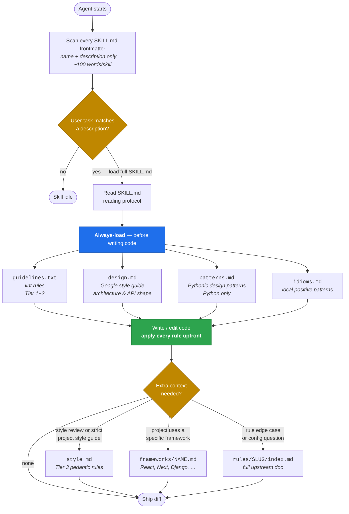
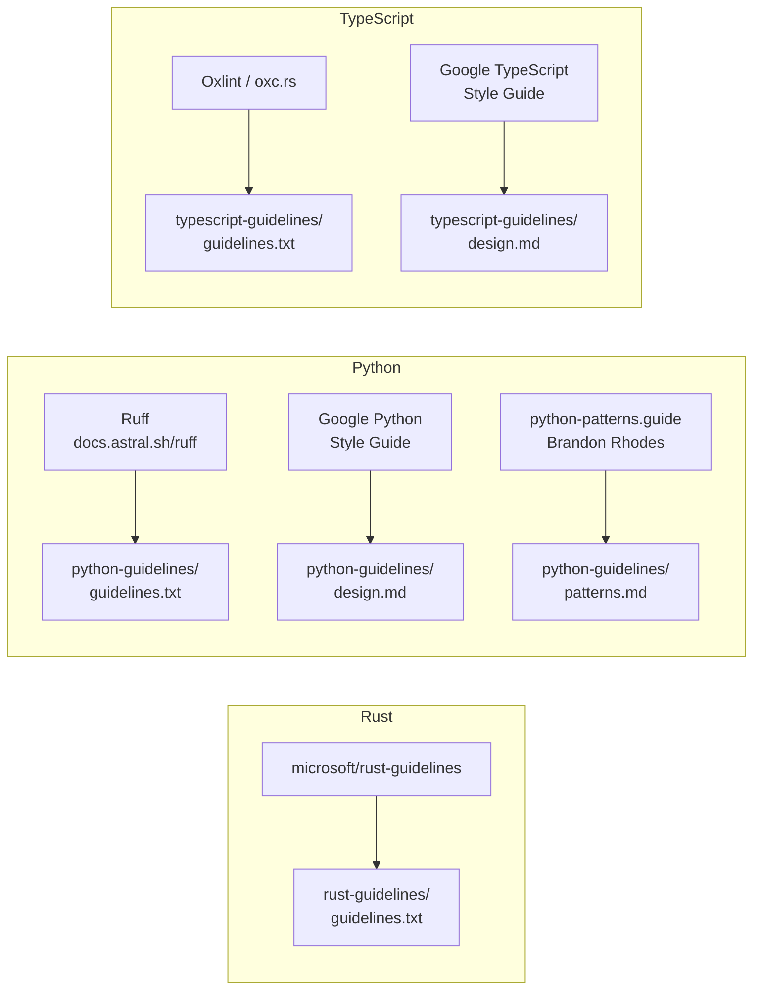

# lang-guidelines

Three language-specific Agent Skills that enforce lint rules, design
guidelines, and idiomatic patterns while an AI agent writes or edits code —
not only during review.

- **`rust-guidelines/`** — Microsoft's Pragmatic Rust Guidelines
  (2,437 sections: API design, errors, docs, FFI, safety, perf, crates).
- **`python-guidelines/`** — 955 Ruff lint rules (tiered) + Google Python Style
  Guide (design) + python-patterns.guide (Pythonic design patterns).
- **`typescript-guidelines/`** — 720 Oxlint lint rules (tiered) + Google
  TypeScript Style Guide (design).

Each skill is a self-contained folder following the open
[Agent Skills standard](https://agentskills.io). Works unchanged with
Claude Code, Codex, Gemini CLI, Cursor, VS Code, GitHub Copilot, OpenCode,
OpenHands, Goose, and [30+ other agents](https://agentskills.io/home).

## How it works

Skills use **progressive disclosure**: metadata is always in context, the
body loads on trigger, and supporting files load on demand. The agent picks
up architectural guidance *before* writing any code, not during review.



And the source-to-skill mapping — where each always-loaded file comes from:



## What the agent sees at trigger time

| Skill | Always-loaded | On-demand | Framework-gated |
|---|---|---|---|
| `rust-guidelines` | `guidelines.txt` (~150 KB, 2437 sections) | — | — |
| `python-guidelines` | `guidelines.txt` (161 KB, 642 lint rules) · `design.md` (116 KB, Google style guide) · `patterns.md` (226 KB, python-patterns.guide) · `idioms.md` | `style.md` (73 KB, 275 pedantic lint rules) · `rules/<slug>/index.md` | `frameworks/{airflow,django,fastapi,numpy,pandas}.md` |
| `typescript-guidelines` | `guidelines.txt` (61 KB, 210 lint rules) · `design.md` (122 KB, Google style guide) · `idioms.md` | `style.md` (91 KB, 280 pedantic lint rules) · `rules/<plugin>/<slug>/index.md` | `frameworks/{react,nextjs,vue,jest,vitest,jsdoc}.md` |

Each rule is rendered in a compact, imperative form:

```
### no-console (eslint)
Do not use console methods in production code.
❌ console.log("debug", user)
✅ logger.debug({ user }, "debug")
```

## Layout

```
rust-guidelines/
├── SKILL.md
└── guidelines.txt

python-guidelines/
├── SKILL.md
├── guidelines.txt       # Tier 1 (correctness+security) + Tier 2 (modernization) lint rules
├── design.md            # Google Python Style Guide — design decisions
├── patterns.md          # python-patterns.guide — Pythonic design patterns
├── idioms.md            # Positive local patterns ("prefer X over Y")
├── style.md             # Tier 3 style/pedantic (load on demand)
├── frameworks/          # Gated by project stack (airflow, django, fastapi, numpy, pandas)
└── rules/<slug>/index.md  # Full per-rule docs with examples + config

typescript-guidelines/
├── SKILL.md
├── guidelines.txt       # Tier 1 + Tier 2 lint rules
├── design.md            # Google TypeScript Style Guide — design decisions
├── idioms.md            # Positive local patterns
├── style.md             # Tier 3 style/pedantic (load on demand)
├── frameworks/          # react, nextjs, vue, jest, vitest, jsdoc
└── rules/<plugin>/<slug>/index.md
```

## Install

### Recommended — `skills` CLI ([skills.sh](https://skills.sh/))

The open-ecosystem CLI from Vercel Labs supports 45+ agents (Claude Code,
Codex, Cursor, Gemini, OpenCode, Copilot, Goose, Windsurf, Amp, Kiro,
Factory Droid, Roo, Cline, …). One command per project or global:

```bash
# Install all three skills globally (symlinked, easy updates)
npx skills add youssef-tharwat/lang-guidelines --all -g

# Or install just one
npx skills add youssef-tharwat/lang-guidelines --skill python-guidelines -g

# Or scope to a single project
cd my-project
npx skills add youssef-tharwat/lang-guidelines --all

# Target specific agents
npx skills add youssef-tharwat/lang-guidelines --all -a claude-code -a cursor
```

Browse the live leaderboard at <https://skills.sh/> or search for the repo at
`skills.sh/youssef-tharwat/lang-guidelines` once install telemetry accumulates.

### Manual — `git clone` + symlinks

For agents not yet supported by the CLI, or for custom install locations:

```bash
git clone https://github.com/youssef-tharwat/lang-guidelines ~/src/lang-guidelines

# Claude Code
ln -s ~/src/lang-guidelines/rust-guidelines       ~/.claude/skills/rust-guidelines
ln -s ~/src/lang-guidelines/python-guidelines     ~/.claude/skills/python-guidelines
ln -s ~/src/lang-guidelines/typescript-guidelines ~/.claude/skills/typescript-guidelines

# Gemini CLI (~/.gemini/skills/), Codex, OpenCode, … — same pattern, different target dir.
# See per-agent docs at https://agentskills.io/home.
```

### Direct copy (any agent)

```bash
cp -R rust-guidelines       <agent-skills-dir>/
cp -R python-guidelines     <agent-skills-dir>/
cp -R typescript-guidelines <agent-skills-dir>/
```

## How the agent uses a skill

1. At startup the agent reads every skill's `name` and `description` from
   `SKILL.md` frontmatter (~100 words each, always in context).
2. When a user task matches a skill's description, the agent loads the full
   `SKILL.md` body.
3. `SKILL.md` instructs the agent to read `guidelines.txt` and `idioms.md`
   before writing code.
4. For style reviews or framework-specific work, the agent loads `style.md` or
   `frameworks/<name>.md` on demand.
5. For edge cases, the agent greps `rules/<slug>/index.md` for the full
   upstream doc.

Progressive disclosure keeps the context footprint minimal while making all
~4,000 rules reachable.

## Sources

**Rust**
- Guidelines (lint + design combined): [microsoft/rust-guidelines](https://github.com/microsoft/rust-guidelines) — Microsoft's Pragmatic Rust Guidelines

**Python**
- Lint rules: [docs.astral.sh/ruff/rules/](https://docs.astral.sh/ruff/rules/) — Ruff
- Design guidelines: [google.github.io/styleguide/pyguide.html](https://google.github.io/styleguide/pyguide.html) — Google Python Style Guide
- Design patterns: [python-patterns.guide](https://python-patterns.guide/) — Brandon Rhodes

**TypeScript / JavaScript**
- Lint rules: [oxc.rs/docs/guide/usage/linter/rules](https://oxc.rs/docs/guide/usage/linter/rules) — Oxlint
- Design guidelines: [google.github.io/styleguide/tsguide.html](https://google.github.io/styleguide/tsguide.html) — Google TypeScript Style Guide

Rule text, examples, and configuration are from the upstream documentation.
The compiled `guidelines.txt` / `style.md` / framework files are derivative
digests generated to fit in an agent's working context. `design.md` and
`patterns.md` are redistributed with attribution under each upstream's license
(all Apache-2.0 or MIT-compatible).

## License

Project scaffolding, compiled digests, tiering, and imperative rewrites in
this repo are MIT. Per-source content retains its upstream license:

- Rust guidelines — MIT (Microsoft)
- Ruff rules — MIT
- Oxlint rules — MIT
- Google Python & TypeScript style guides — Apache 2.0
- python-patterns.guide — content copyright Brandon Rhodes, redistributed here
  for attribution and agent reference; canonical authoritative version lives
  at the source URL.

## Contributing

Issues and PRs welcome. To regenerate the compiled files after upstream rule
changes, fetch the latest rule pages and re-run the builder (see commit
history for the scripts used).
